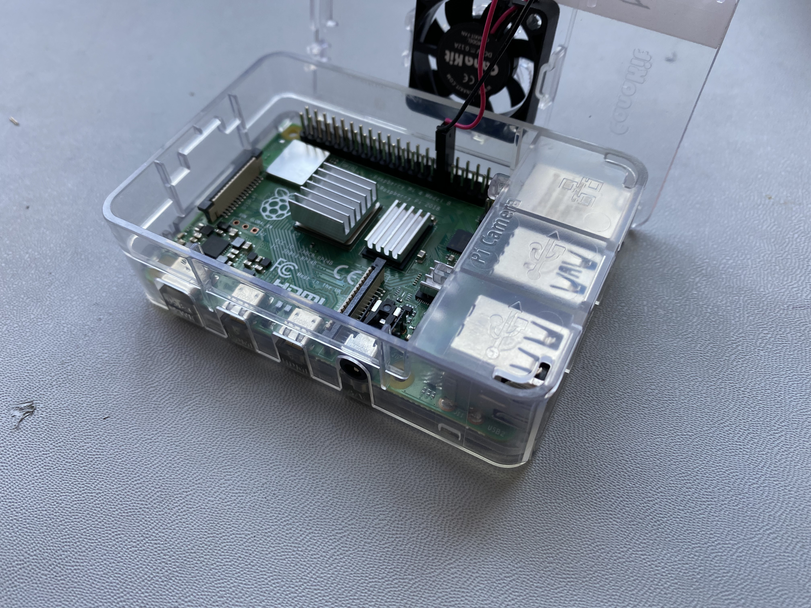
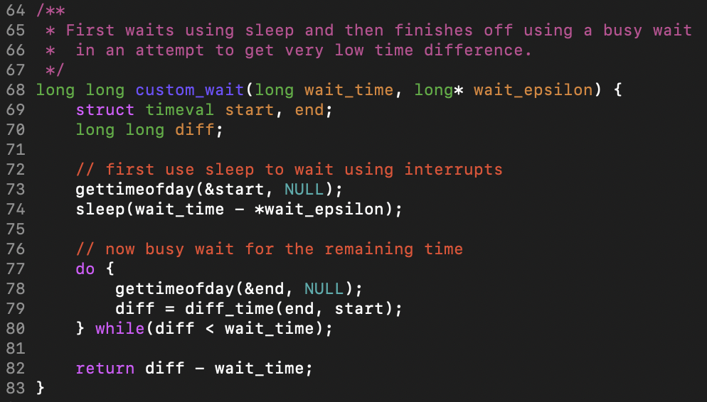
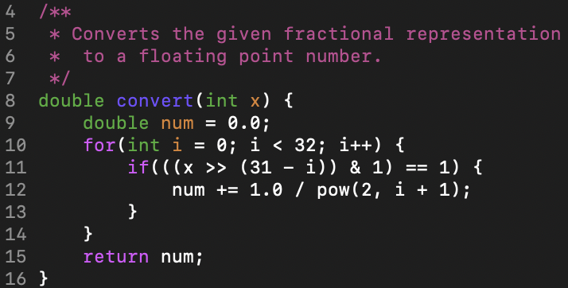
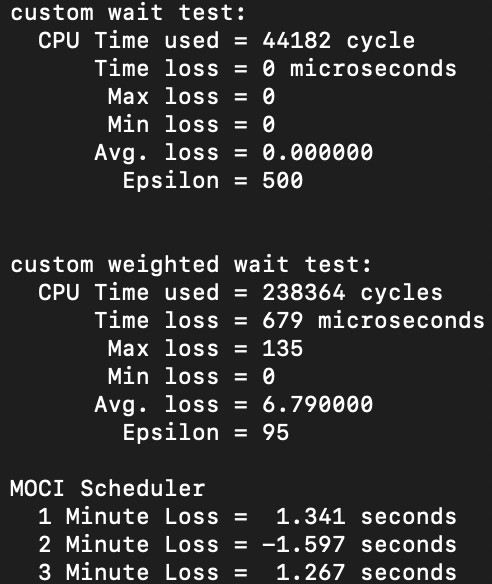
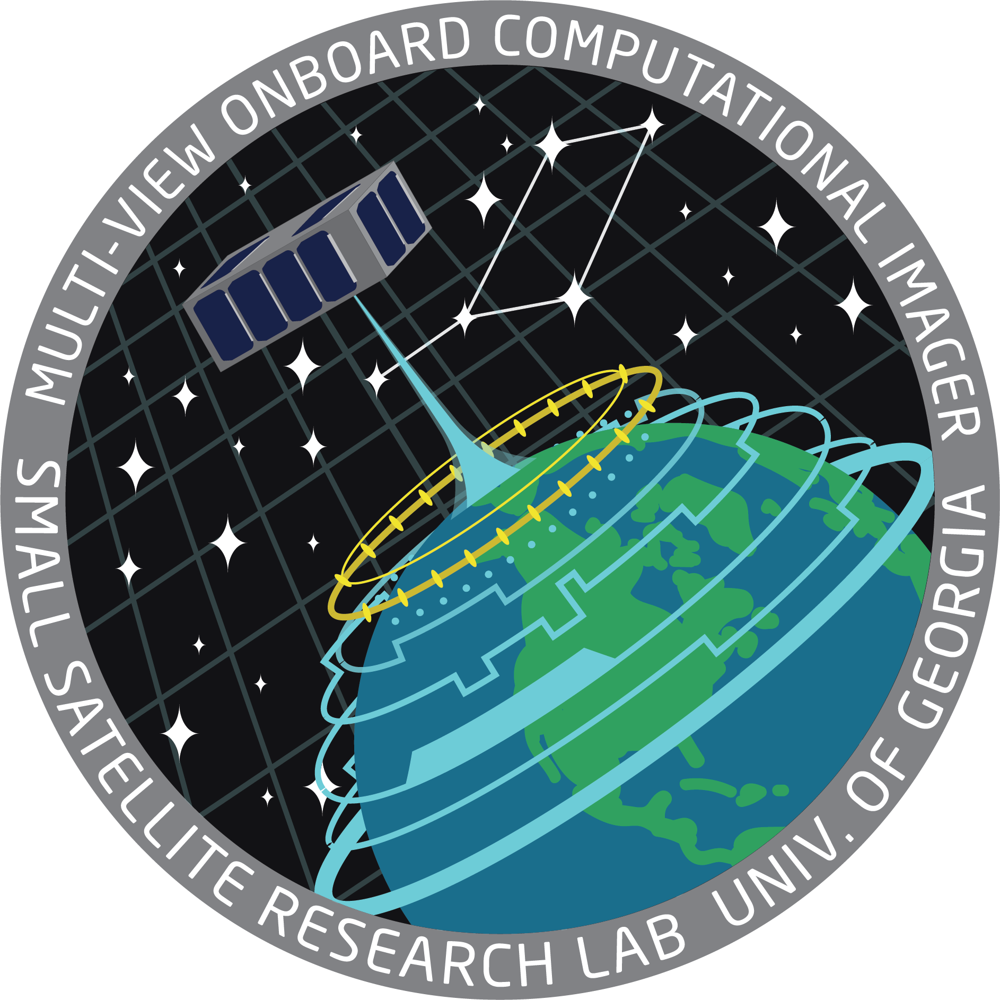

# Operating Systems and Small Satellites: How Mission Requirements Shape Operating System Selection

**Cameron Bonesteel"1, Evan Tichenor%1, Deepak R. Mishra#1**

**"cameron.bonesteel@uga.edu, %evan.tichenor@uga.edu, #dmishra@uga.edu, 1Small Satellite Research Laboratory, University of Georgia**

## RESEARCH OVERVIEW
The goal of our research was to analyze cubesat mission requirements and their technical impacts on operating system selection. To achieve this goal, mission requirements set by the Small Satellite Research Lab (SSRL) for the Multiview Onboard Computational Imager (MOCI) and the Mission for Education and Multimedia Engagement (MEMESat-1) missions were analyzed along with simulated components from each satellite that were run on different operating systems. This method will allow us to analyze the performance and timing of mission critical tasks on each operating system to highlight the advantages and disadvantages of one operating system over another.

The benefit of having both missions is that each has drastically different mission requirements, which has lead to different design choices. The MOCI mission requires specific timings, while the MEMESat-1 mission resembles a radio repeater that will have operational and non-operational states.

<small>**Figure 1:** The Raspberry Pi 4 used as the mock MEMESat-1 OBC.</small>

## BACKGROUND
Small satellite mission requirements cover a lot of different areas, including mission objects, success criteria, and specific technical requirements for systems and subsystems. The technical requirements will be the main focus of this research as they will be the most influential on the selection of an operating system. The mission requirements are outlined in Table 1 as they are presented in the requirements verification matrix (RVM) for each mission.

The MOCI-01 requirement gives a broad requirement for imaging, with the result being that more precise subsystem requirements are needed to specify timing restraints. Imaging of targets requires precise timing from the scheduling system.

The MEME-01 and MEME-06  requirements highlights the radio requirements of the mission. Providing radio communications is less timing specific and more on the side of providing a service. This service has a constraint of having a high data rate so images can be downlinked quickly, but otherwise has no scheduler timing restraints.

Finally, the C&DH-04 requirement from both missions highlights that scheduling is required for each mission. However, the precision of that scheduling is what differs.

| Requirement Number | Description                                                                       | Source           | Verification Method |
|--------------------|-----------------------------------------------------------------------------------|------------------|---------------------|
| MOCI-01            | MOCI shall be capable of taking RGB and grayscale images.                         | MO-1, MO-2, MO-3 | Demonstration       |
| MEME-01            | MEMESat-1 shall provide amateurs in every country on Earth with memes.            | MO-1, MO-2       | Demonstration       |
| MEME-06            | MEMESat-1 shall be capable of downlinking a meme within a single pass over the GS | MO-1             | Test                |
| C&DH-04            | MOCI/MEMESat shall receive operational schedules from the ground station.         | MO-1, MO-2. MO-3 | Demonstration       |

<small>**Table 1:** The list of relevant mission requirements as listed in the MOCI RVM[1] and MEMESat-1 RVM[2].</small>

## METHODOLOGY
Our main approach was to use wait functions to analyze time loss by comparing the actual time taken and the requested wait time to determine precision across the operating systems. To accomplish this, two different methods were used. For the traditional operating system, we created a C program that uses a few different waiting implementations. The custom functions used sleep as the primary waiting method, with two of the other functions finishing the wait period with a busy wait in an attempt to reduce time loss.

For the Real Time Operating System (RTOS), we added timing functionality inside of our existing scheduling system for the MOCI satellite. This system allows us to specify a transition to a new operational mode after a set delay. To calculate the difference in timings, we found the system time to a resolution of approximately 233 picoseconds[3] from when the schedule was uploaded to when it transitioned. This difference shows the fractional time loss as all transitions should have been precise to the second. Any additional time shown between the two times would represent a time loss for the scheduler operation which can be ignored.

<small>**Figure 2:** The code for the custom wait function used during testing.</small>

<small>**Figure 3:** The code used to convert fractional integar to floating point.</small>

## CONCLUSION AND FUTURE IMPROVEMENTS
Due to some flaws in methodology, the data we have derived is not yet conclusive. The custom tests run on the traditional operating system appear to be affected by low level implementation differences between hardware. This has made collecting the data inconsistent and possibly overall inaccurate. The numbers are accurate for the specific tests but may not be truly representative of the system.
Similarly, the implementation of the scheduler onboard MOCI may have hidden overhead time that is not accounted for in the time loss. Between transitions in operational modes, there may be variable accesses and function calls that are causing “loss” within the timing of the transition. 
These flaws will be investigated further, with the likelihood of methodology being the same across the operating systems to provide better, more accurate results for data comparison. 

<small>**Figure 4:** Custom timings from the Raspbian Lite operating system as well as scheduler time loss from the FreeRTOS operating system on MOCI.</small>

### References
[1] Evan Lengle (2021), MOCI RVM (v11.0), Internal Document

[2] Caroline Lassiter (2022), MEMESat-1 RVM (v3.0), Internal Document

[3] Nathan Brookes, Peter Mendham (2018) Bright Ascension Manual (v2.8), Internal Document

 

